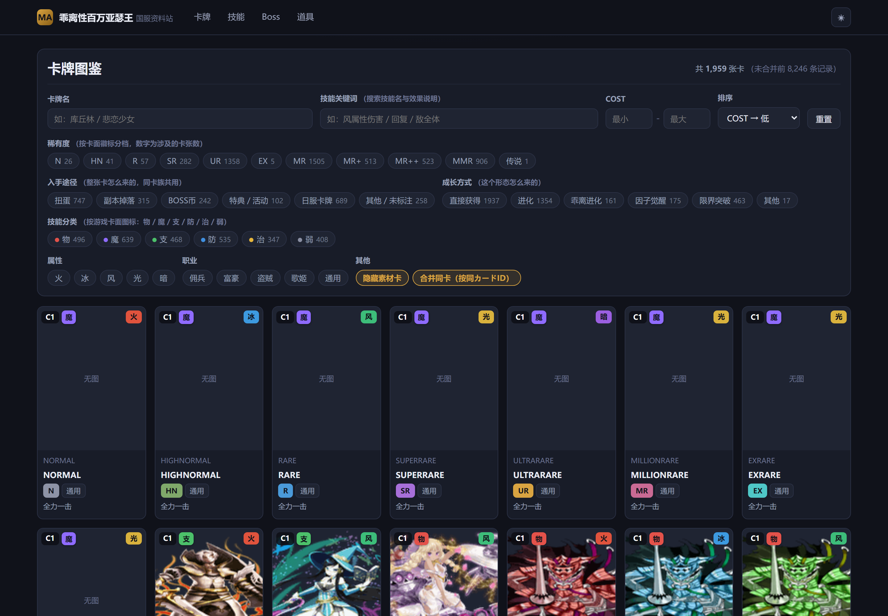
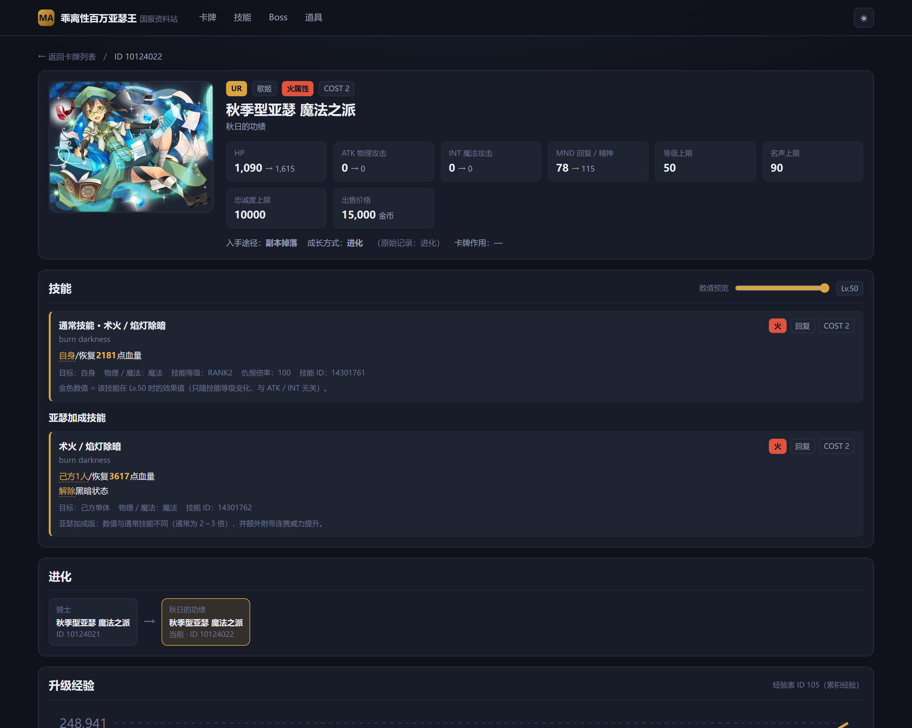

# 乖离性百万亚瑟王 · 国服资料站

基于《乖离性百万亚瑟王》国服客户端资源构建的非盈利资料查询站。纯静态数据 + 本地服务，无需数据库，全栈可离线运行。

| 卡牌图鉴 | 卡牌详情 |
| --- | --- |
|  |  |

## 功能一览

- **卡牌图鉴**：1,959 张实体卡，按稀有度 / 属性 / 职业 / 技能分类（物魔支防治弱）/ 入手途径 / 成长方式多维筛选，支持技能关键词检索（40 个术语、中日文别名）
- **技能数值解算**：等级滑杆实时预览技能数值，占位符覆盖率 99.9%，未验证类型灰显不乱猜
- **进化链与素材**、升级经验表、**Boss** 状态与特殊行动轴、道具查询
- **便携包**：内置 Node 运行时，解压双击即用，无需安装任何环境

## 快速开始（只使用，不开发）

1. 到 [Releases](https://github.com/xiaguanbushuai/karisei-ma-ch-wiki/releases/latest) 下载 `kairisei-wiki-portable-*.zip`
2. 解压后双击 `start.cmd`，浏览器自动打开 `http://127.0.0.1:5173/`
3. 关闭黑色命令窗口即退出

极简版仅含缩略图（列表与详情页正常显示）；把卡面资源仓库的 `.webp` 文件放进 `images/full/chr51/` 即可恢复高清原图，详见包内 `README.txt`。

## 在新电脑上继续开发

### 环境要求

| 依赖 | 版本 | 用途 |
| --- | --- | --- |
| Node.js | ≥ 22 | 前端开发 / 构建 |
| Python | ≥ 3.10（开发用 3.13） | ETL 数据生成、打包脚本 |
| Pillow | 任意近期版本 | 缩略图生成、卡面转码（`pip install pillow`） |
| 游戏服务端资源集 | kairisei-ma-ch 发行包 | 数据源（约 13GB，**不进本仓库**，见下） |

### 1. 拉取代码

```bash
git clone git@github.com:xiaguanbushuai/karisei-ma-ch-wiki.git
cd karisei-ma-ch-wiki
```

### 2. 安装依赖

```bash
npm install --ignore-scripts
```

> ⚠️ 必须带 `--ignore-scripts`：esbuild 的 postinstall 脚本在部分 Windows 环境报 EBUSY；
> rollup 的 win32-x64 平台包已固定在 devDependencies，无需 postinstall 也能正常构建。

### 3. 准备数据源

数据源是 [kuuhaku1314/kairisei-ma-ch](https://github.com/kuuhaku1314/kairisei-ma-ch) 服务端发行包里的 `resource-set/`（官方主表 CSV + 卡面原图，解压后约 13GB）。下载解压后，**任选一种**方式告诉脚本它在哪：

| 方式 | 做法 | 适用场景 |
| --- | --- | --- |
| 环境变量 | 设 `KAIRI_SRC` = 资源集根目录；卡面原图目录默认按 `resources/image` 推导，也可用 `KAIRI_IMAGE_ROOT` 单独指定 | 临时跑一次 / CI |
| 本地配置 | 复制 `tools/local_config.example.json` 为 `tools/local_config.json` 并填入路径 | 日常开发（该文件不会被提交） |
| 默认位置 | 把资源集放到工程平级：`<工程上级目录>/kairisei-ma-cn602-server/resource-set` | 懒人方案 |

Git Bash 下用环境变量的写法：

```bash
export KAIRI_SRC="/d/games/kairisei-ma-cn602-server/resource-set"
```

> 解析顺序统一为：**环境变量 → `tools/local_config.json` → 默认位置**。
> Python 侧实现在 `tools/local_paths.py`，Vite 侧在 `vite.config.js` 顶部，两侧共用同一套规则。

实际用到的目录只有两处（其余为服务端运行资源，可不管）：

```
resource-set/
├─ _local/control/server/
│  ├─ cn602-card-master/     # 卡牌 / 物品主表 CSV
│  └─ cn602-battle-master/   # 技能 / 敌方行动主表 CSV
└─ resources/image/chr51/    # 卡面立绘 PNG（5.4GB，4385 张）
```

### 4. 生成数据与缩略图

```bash
python tools/etl.py       # 官方 CSV → public/data/*.json（约 26MB，约 4 秒）
python tools/thumbs.py    # 卡面缩略图 → .cache/thumbs（4385 张约 68MB，全量约 4 分钟）
```

- `public/data/*.json`（26MB 数据快照）**已随仓库提供**，克隆即可直接开发；想基于最新资源集重新生成，跑一次 `etl.py` 覆盖即可。
- `.cache/thumbs/` 未进仓库（68MB），**必须本地跑一次 `thumbs.py`**，否则列表页看不到卡面缩略图。

### 5. 开发调试

```bash
npm run dev               # http://127.0.0.1:5173
```

卡面原图不复制进工程，由 `vite.config.js` 的中间件从资源集按需流式提供：

- `/cardimg/thumb/chr51/*.png` → `.cache/thumbs`（缩略图）
- `/cardimg/chr51/*.png` → 资源集原图（无缩略图时兜底）

### 6. 构建与打包便携包

```bash
npm run build                          # 产出 dist/
python tools/build_portable.py         # 极简版（缩略图，约 173MB）
python tools/build_portable.py --full-images   # 完整版（附带 5.4GB 原图）
```

产物输出到工程外 `../release/kairisei-wiki-portable/`，双击其中 `start.cmd` 即可验证。

## 项目结构

```
├─ public/data/            # ETL 数据快照（已随仓库提供；重生成见 tools/etl.py）
├─ src/
│  ├─ views/               # Home / CardList / CardDetail / SkillList / BossList / BossDetail / ItemList
│  ├─ components/SkillText.vue   # 技能文本渲染（关键词高亮 + {N} 数值解算）
│  ├─ api.js               # 数据加载、属性配色、数值槽位解算
│  ├─ keywords.js          # 技能术语分词
│  └─ router.js            # hash 路由（便携包无需服务端 SPA 配置）
├─ tools/
│  ├─ etl.py               # 官方 CSV → 前端 JSON（核心）
│  ├─ thumbs.py            # 卡面缩略图（Pillow FASTOCTREE 量化）
│  ├─ webp_full.py         # 卡面 PNG → WebP q85 批量转码（供备份仓库）
│  ├─ build_portable.py    # 便携包打包脚本
│  ├─ local_paths.py       # 资源集路径解析（环境变量 → 本地配置 → 默认值）
│  ├─ local_config.example.json  # 本机路径配置模板（复制为 local_config.json 使用）
│  ├─ source_override.json # 卡牌入手途径手工覆盖表
│  ├─ shot.sh / shot.mjs   # 无头浏览器截图工具（开发辅助）
│  └─ portable/            # 便携包内置文件（零依赖本地服务、启动脚本、授权）
├─ docs/                   # README 截图
└─ vite.config.js          # dev server + 卡面图片中间件
```

## 数据链路

```
kairisei-ma-ch resource-set（官方 CSV，日文表头）
        │  tools/etl.py
        ▼
public/data/*.json（cards / skills / evolutions / boss_index / boss_detail / enemy_skills / items / exp_tables / keywords / meta）
        │  vite build
        ▼
dist/ → 便携包 web/
```

技能数值说明文本中的 `{N}` 占位符由 ETL 按「機能」模型解算为真实数值（公式仅依赖卡牌等级）。
已验证类型覆盖率 99.9%（21,256 / 21,267 槽位）；无法解算的槽位前端灰显为 `?` 并给出悬停提示，宁可留白不猜数值。
解锁新的機能类型需要游戏内实测数据定标，流程见仓库维护者的技能笔记。

## 卡面资源备份

原始 PNG（5.4GB）超出 GitHub 仓库限制，已转码为 WebP q85（约 1.0GB，画质无可感知差异）单独存放：
[karisei-ma-ch-cards](https://github.com/xiaguanbushuai/karisei-ma-ch-cards)。
便携包服务端支持 `.png` 请求自动回落到同名 `.webp`，下载后放入 `images/full/chr51/` 即用。

## 致谢

- **[kuuhaku1314/kairisei-ma-ch](https://github.com/kuuhaku1314/kairisei-ma-ch)** —— 《乖离性百万亚瑟王》国服社区保存与本地运行项目。
  本站的全部卡牌数据与卡面立绘均取自该项目的资源集，没有它就没有这个资料站。感谢作者及所有参与保存这款游戏记忆的社区同好。
- 以及《乖离性百万亚瑟王》国服的所有玩家——正是大家多年的记录与分享，让这些数据还能被拼凑完整。

## 授权与免责

- **代码**：PolyForm Noncommercial 1.0.0 —— 允许非商业目的的使用、修改与分发，但必须保留授权声明；禁止任何商业用途。全文见根目录 [LICENSE](LICENSE)。
- **游戏素材**（卡牌名称、技能文本、立绘、Boss 数据）：版权及相关权利归 **SQUARE ENIX CO., LTD.** 及该游戏原运营方所有，本仓库与权利人无任何关联、未获其授权或认可。
- 本站为爱好者制作的非盈利资料查询工具，仅供个人学习、研究与怀旧参考；请勿将原始素材用于商业用途、二次分发或转售。收到权利人通知时应立即停止使用并删除相关素材。
- 便携包内的 Node.js 运行时按 MIT 许可分发，详见包内 `LICENSE` 的第三方组件说明。
